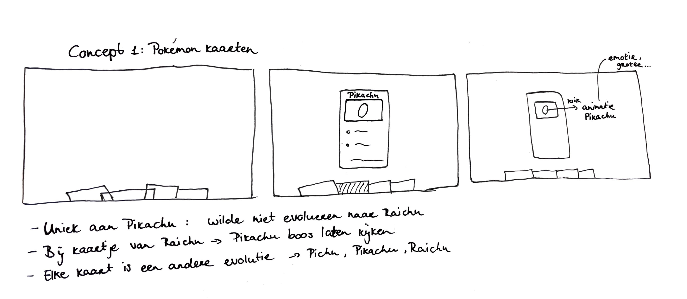
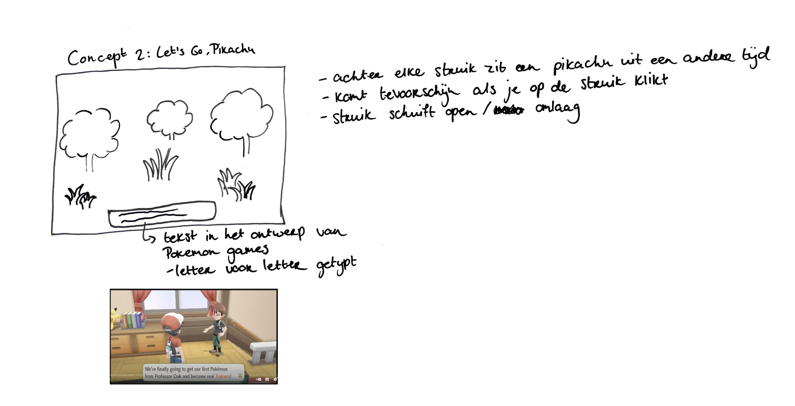
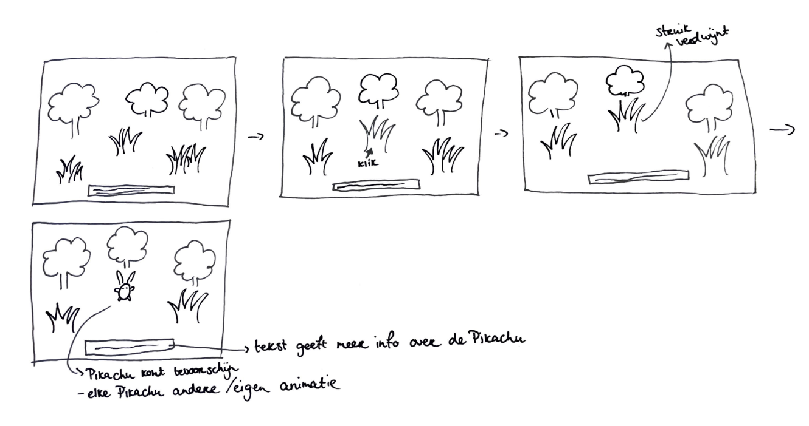

# Procesverslag
## Dag 1
Tijdens de eerste dag was het vooral belangrijk om een character uit te kiezen en hier research over te doen. Mijn eerste keuze was Pikachu, maar omdat ik veel mensen om mij heen characters hoorde kiezen die niet uit het lijstje kwamen wilde ik ook nog verder nadenken. Toch bleef mijn keuze bij Pikachu omdat ik daar al een aantal ideeën bij had. Tijdens de eerste dag deed ik daarom vooral research naar mijn character.

Ik merkte dat ik best wel beperkt bleef in mijn ideeën, omdat ik meteen dacht aan hoe ik het zou moeten coderen. Mijn eerste idee waren om Pokémon kaarten te gebruiken als lay-out om de verschillende evoluties van Pikachu te laten zien. Verder had ik het nog niet concreet uitgewerkt.

## Dag 2
Aan het begin van de dag begonnen we met de eerste feedbacksessie. Omdat ik op Miro nog niet iets had neergezet, kon de persoon naast mij er nog niet veel feedback op geven. Ik had mijn eerste idee wel aan haar uitgelegd en daarop had zij haar feedback gegeven, wat mij wel verder heeft geholpen. Ik kon naar aanleiding van haar feedback mijn idee verder uitwerken. Ik ben toen meteen begonnen met schetsen. 

Tijdens het schetsen kwam ik eigenlijk weer op een ander idee. Ik wist namelijk ook niet zeker of ik wel de juiste richting opging qua "tijdlijn". Mijn eerste gedachte was een tijdlijn waarin de verschillende evoluties van Pikachu te zien waren, maar het zou natuurlijk ook kunnen gaan over Pikachu door de jaren heen qua design. Toen ik als antwoord van de docent kreeg dat het niet uitmaakt, koos ik er toch voor om verder te gaan met de evoluties. 

Mijn tweede idee was gebaseerd op een Nintendo spel van Pokémon (Let's go Pikachu). In dit spel moeten Pokémons gevonden worden. Het leek mij dus leuk om dit ontwerp te nemen, zodat het ook echt past bij Pikachu. Hoe ik het voor me zag, was een landschap als achtergrond met daarin struiken waar een Pikachu achter verstopt zit. Zodra er op zo'n struik geklikt wordt, komt de Pikachu tevoorschijn. Onderin zal een tekstbalk zijn, in de stijl van het spel, waar de informatie over de Pikachu in verteld zal worden. 

Nadat ik dit idee ook had geschetst kwam ik nog even terug bij de persoon die naast mij zat om feedback te vragen. Ze gaf hier handige feedback op waar ik weer verder mee kon. Het ging er voornamelijk om dat dit idee iets creatiever is, maar dat ik wel bepaalde elementen uit mijn eerste idee er nog in zou kunnen verwerken. 

Ik ben mijn idee daarom verder gaan uitwerken en heb toen besloten om met dit idee verder te gaan. 

## Dag 3
Vandaag wilde ik gaan beginnen aan coderen. Ik had alleen geen idee waar ik zou moeten beginnen. Ik probeerde mijn ontwerp onder te verdelen om te kijken aan welk deel ik zou kunnen beginnen. Toen kwam daaruit dat ik de struiken, die uiteindelijk buttons zouden worden, op een rij zou kunnen zetten en daaronder het gedeelte met tekst. Toen ik daar eenmaal over uit was, realiseerde ik mij dat ik nog geen afbeeldingen had die ik kon gebruiken. Ik kreeg als tip van een klasgenoot om een AI programma te gebruiken. Dit had een hele goede optie kunnen zijn, alleen was het programma overbelast toen ik het wilde gebruiken. Ik moest daarom met een plan B komen. Mijn plan B was om het zelf te ontwerpen. 

Om verder te komen met coderen, ben ik naar de docent gegaan om hulp te vragen. Ik heb mijn idee laten zien en gevraagd hoe ik moest beginnen. Hij legde uit hoe mijn ontwerp in elkaar zat en dat ik de struiken in een list kon zetten. Dit schreef hij snel voor mij uit op een blaadje en gaf mij ook een aantal websites om naar te kijken voor code. Hij vertelde mij om te beginnen met de buttons. De struiken zouden een button moeten vormen met daarachter een Pikachu. 

## Dag 4
Ziek.

## Dag 5
Vandaag ben ik begonnen met het coderen. Ik probeerde te maken wat de docent mij twee dagen geleden vertelde. Door naar de oefeningen te kijken die hij mij als tip gaf en andere websites op te zoeken, is het mij gelukt om de afbeeldingen zo te krijgen als dat ik wilde! Ook heb ik een afbeelding gevonden die ik kan gebruiken als achtergrond en struiken die ik als button kan gebruiken. 

Ik wilde eerst nog verder oefenen met de code, dus heb ik eerst de oude afbeeldingen gebruikt om verder te gaan met de code. Hetgeen waar ik mee zou kunnen beginnen waren de afbeeldingen op de juiste positie zetten en buttons maken van de struiken. Ik ben online gaan kijken hoe ik dat moest doen. De docent gaf al aan dat dit met 'position: absolute' zou kunnen. Via een voorbeeld uit (https://programmersportal.com/css/how-to/overlap-images.php) kon ik dit toepassen op mijn afbeeldingen. Na even puzzelen is het mij gelukt om met de code uit het voorbeeld mijn afbeeldingen juist neer te zetten.

## Dag 6
Vandaag is de tweede week begonnen. In het weekend heb ik nog kunnen werken aan de juiste illustraties die ik wilde gebruiken, samen met een kennis van mij. Hij is namelijk erg goed in digitaal illustreren en kon mij hier gelukkig bij helpen. Ik wilde namelijk afbeeldingen hebben in een specifieke stijl, van een Pokémon game. De afbeeldingen van Pichu, Pikachu en Raichu heb ik wel van het internet afgehaald. 

De les begon met een feedbacksessie. De persoon die naast mij zat en ik keken naar elkaars werk en konden elkaars beoordelingsformulier invullen. Ik merkte toen dat nog achterloop, maar wel de goede kant op ga. Over de meeste punten had ik al nagedacht, alleen nog niet uitgevoerd. 

Om deze week te beginnen, kon ik de nieuwe afbeeldingen gebruiken in de code die ik al had geschreven. Dit was gelukt, maar omdat ik dit keer ook een achtergrond foto had toegevoegd, kreeg ik de andere afbeeldingen van Pikachu en de struiken opeens niet meer op de juiste positie. Ze stonden namelijk onderaan de pagina, omdat mijn achtergrond apart stond van de rest. Ik wist niet zo goed hoe ik dit moest oplossen, dus vroeg ik of een klasgenoot mij hier misschien bij kon helpen. Hij kon mij met behulp van zijn eigen code mij hier gelukkig bij helpen. 

## Dag 7 
Vandaag was ik niet in de les. Ik wilde in mijn eigen tijd verder werken aan mijn ontwerp en code. Een vriendin van mij is een stuk beter in coderen dan ik. Ik heb haar daarom om hulp gevraagd om mij verder te helpen. Ze heeft mij toen geholpen met de animaties toevoegen aan de struiken en de Pokémons. Ze heeft mij uitgelegd hoe het werkt, maar ik vond het nog wel heel moeilijk om zelf te schrijven. Ook heeft ze mij geholpen bij javascript schrijven, want dit was voor mij een nog ergere ramp. 

Het is uiteindelijk met haar hulp gelukt om de struiken te laten verdwijnen wanneer je erop klikt, zodat er een Pokémon tevoorschijn komt. Daarnaast wilde ik ook dat het bedienbaar zou worden door middel van pijltjes op het toetsenbord. Dat is ook gelukt met haar hulp. 

## Dag 8 
Vandaag is de laatste les. Ik begon de dag met mijn werk op Github zetten, zodat ik een derde feedbackronde kon doen. Ik deed deze samen met Luuk. We bekeken elkaars werk en vulden het beoordelingsformulier voor elkaar in. Ons werk was nog niet af, maar we hadden wel al de basis die we aan elkaar konden laten zien. We hadden dit al aan elkaar aangegeven en ook wat we nog precies wilden toevoegen, zodat we hier rekening mee konden houden in onze beoordeling. Mijn beoordelingsformulier is er over het algemeen wel goed uitgekomen, omdat ik de basis al heb. Er waren nog wel een paar punten waar ik nog rekening mee moest houden, bijvoorbeeld het gebruik van comments in mijn code en een bronnenlijst toevoegen. Het was daarom goed dat ik dit nog even heb mogen bespreken met Luuk, zodat ik wist waar ik nog verder aan kan werken. 

## Jij

### Ontwerper:
Fenisya Pontoan

#### Je startniveau:
Mijn startniveau is: blauw

# Je plan

  
De eerste versie/schets van je ontwerp & je persoonlijke uitdaging

  ### De eerste versie/schets:
  
  #### Schets 1
  
  
  #### Schets 2
   
  
  #### Schets 3
   

  Zoals ik al in mijn dagboek schreef, hield ik mij bij in het begin erg tegen met mijn ideeën. Dit kwam omdat ik niet wist hoe ik het zou moeten coderen. Toen ik dat los kon laten kwam ik met twee concepten. Het Pokémonkaart concept en het Nintendo spel concept. Het tweede concept heb ik uiteindelijk (naar aanleiding van feedback) gekozen. Uit deze feedback kwam ook dat ik bepaalde elementen uit het eerste concept kon gebruiken. Dit heb ik in de derde schets verwerkt (emoties van Pikachu). 

  ### Je ambitie: 
  Aan deze technieken/punten wil ik werken:
  - code schrijven
  - code begrijpen
  
 

## Voortgang/Feedback 1

  
Mijn bevindingen + wijzigingen (minimaal 5)

  ### Bevinding 1:
  
  - Simpel, plat 
  
  Tijdens de eerste les was ik vooral bezig met het kiezen van een character. Ik koos Pikachu en ging daar vooral research naar doen en bedenken of ik
  hier wel een concept uit kon halen. Mijn eerste idee was daarom nog niet uitgewerkt omdat ik nog zat te twijfelen. 
  
  Mijn eerste idee was om de evoluties van Pikachu weer te geven in Pokemon kaarten. Om dit interactief te maken, zou ik dit bijvoorbeeld in een 
  carroussel kunnen weergeven. Daarbij wilde ik dan animaties als bijvoorbeeld "vuur" toevoegen, omdat Pikachu een vuur type is. Verder had ik het idee nog niet uitgedacht. Als feedback kreeg ik dat ik moet oppassen dat het niet te simpel zal worden. Ook gaf ze mij het idee om de kaarten uit het pakje te laten komen, om het iets speelser te maken. 

  #### oplossing:
  Ik ben daarna begonnen met schetsen. Ik vond het idee met de kaarten uit het pakje heel goed. Om mijn eigen draai eraan te geven heb ik geschetst dat onderin het scherm de kaarten al zichtbaar zijn. Vervolgens kan je een van deze kaarten kiezen, waarna de gekozen kaart naar boven schuift. Op elk van deze kaarten staat een evolutie van Pikachu. Pikachu op deze kaart zal dan ook nog een animatie (emotie, grootte etc.) uitbeelden. 
  
  Wat Pikachu uniek maakt is dat hij niet wilde evolueren in Raichu. Om dit duidelijk te maken kan ik Pikachu boos uitbeelden zodra je op het kaartje klikt van Raichu. 

  ### Bevinding 2:
  
  
  
  Na het uitwerken van concept 1, ben ik nog even verder gaan schetsen. Mijn inspiratie kwam toen van het Nintendo spel Pokemon. Ik wil hier een landschap laten zien met bomen en struiken. Achter elke struik zit er een Pikachu uit een andere tijd verstopt. Als je op een struik klikt, schuift de struik open en komt de Pikachu tevoorschijn. Onderin het scherm is er een tekstbalk, waarin informatie over de Pikachu verteld wordt. Deze tekst wordt op de typische manier afgebeeld, net zoals in het spel: de letters komen 1 voor 1 alsof er wordt getypt. 
  
 

  #### oplossing:
Als feedback kreeg ik dat dit idee ook heel leuk is en minder kaal dan concept 1. Het enige wat concept 1 wel meer liet passen bij mijn character, zijn de emoties die worden afgebeeld in animatie. Dit zou bij concept 2 ook meer terug kunnen komen. Ook het idee van concept 1 met boze Pikachu, wanneer er voor Raichu gekozen wordt, zou in concept 2 verwerkt kunnen worden. Dit kan bijvoorbeeld door middel van tekst. 
  

## Voortgang/Feedback 2

  
Mijn bevindingen + wijzigingen (minimaal 5)

  
  ### Bevinding 1:
 Elementen zijn nog niet netjes uitgelijnd

  #### oplossing:
 

  ### Bevinding 2:
 De pagina is nog niet responsive

  #### oplossing:
  Beschrijving hoe je het hebt hebt opgelost of als het niet gelukt is hoe je het zou oplossen (tekst en afbeeding(en)).

  ### Bevinding 3:
 Interactieve elementen kunnen nog niet met het toetsenbord geselecteerd worden.
  
  #### oplossing:
  
  
  
  ### Bevinding 4:
  De states van interactieve elementen passen nog niet bij het ontwerp
  
  #### oplossing:
  
  
  ### Bevinding 5:
  Er is nog geen commentaar opgenomen om de structuur duidelijk te maken in de CSS en om uitleg te geven
  
  #### oplossing:
  
  
  
  ### Bevinding 6:
  Gebruik van relative units
  
  #### oplossing:
  
  
  
  ### Bevinding 7:
  In de CSS wordt code meerdere malen geschreven (afbeeldingen stijlen)
  
  #### oplossing:
  
  
  ### Bevinding 8:
  Bronnen zijn nog niet opgenomen in readme en code
  
  #### oplossing:

## Voortgang/Feedback 3

  
Mijn bevindingen + wijzigingen (minimaal 5)

  
  ### Bevinding 1:
  Code is nog niet netjes/duidelijik geschreven: commentaar nog toevoegen

  #### oplossing:
  Beschrijving hoe je het hebt hebt opgelost of als het niet gelukt is hoe je het zou oplossen (tekst en afbeeding(en)).

  ### Bevinding 2:
  Bronnenlijst moet nog worden toegevoegd

  #### oplossing:
  Beschrijving hoe je het hebt hebt opgelost of als het niet gelukt is hoe je het zou oplossen (tekst en afbeeding(en)).

  ### Bevinding 3:
  Code kunnen uitleggen
  
  #### oplossing:
  Beschrijving hoe je het hebt hebt opgelost of als het niet gelukt is hoe je het zou oplossen (tekst en afbeeding(en)).
  
  
  

## Reflectie

  
Mijn eindresultaat & persoonlijke ontwikkeling

  ### Je uitkomst - karakteristiek screenshot(s):
  
  
  
  
  
  Dit zijn screenshots van mijn uitkomst. De eerste twee screenshots geven een beeld van mijn concept weer. Achter elke struik verstopt een evolutie van Pikachu. Zodra er eentje verschijnt, komt er ook tekst over deze Pokémon op beeld. 
  
  In de laatste twee screenshots is mijn paasei te zien. Omdat Pikachu eigenlijk niet in Raichu wil evolueren, komt er een boze Pikachu tevoorschijn. Maar zodra je daar nog een keer op klikt, dan komt Raichu gewoon in beeld. Op deze manier wilde ik de verschillende evoluties van Pikachu in beeld brengen.

  ### Dit ging goed/Heb ik geleerd: 
  Korte omschrijving met plaatje(s)

  
  
  In het begin wist ik totaal niet hoe ik moest beginnen met code schrijven. Nadat ik hierover naar de docent ben geweest en hij mij heeft geholpen door te vertellen met wat ik kon beginnen, begreep ik het een stuk beter. Ik begon toen door de afbeeldingen op de juiste positie te plaatsen. Dit heeft even geduurd, maar zoals op de afbeelding hierboven te zien is lukte het mij wel. Hier was ik zelf al heel trots op en kreeg ik meer vertrouwen om zelf verder te gaan. 

  ### Dit was lastig/Is niet gelukt:
  Korte omschrijving met plaatje(s)

  
  
  In de screenshot hierboven is te zien hoe de tekst zich weergeeft. Ik wilde eigenlijk, net zoals in het spel, dat de tekst zich zou splitten in delen waardoor het blok verticaal niet zou groeien. Dit was mij niet gelukt. Overigens heb ik de javascript code niet zelf geschreven. Ik weet in grote lijnen wat er staat en waarvoor, maar zelf had ik te veel moeite om dit zelf te doen. 

## Bronnenlijst

continu bijhouden terwijl je werkt

Nb. Wees specifiek ('css-tricks' als bron is bijv. niet specifiek genoeg).

1. https://programmersportal.com/css/how-to/overlap-images.php
2. https://github.com/fenisyahva/VIDii/edit/main/index.html 
3. https://codepen.io/shooft/live/WNJXQjv
4. https://www.hiclipart.com/free-transparent-background-png-clipart-iyiuh 
5. https://www.nicepng.com/maxp/u2q8e6t4w7o0a9r5/ 
6. https://www.pngplay.com/nl/image/285064
7. http://www.stickpng.com/img/games/pokemon/angry-pikachu-pokemon 
8. Achtergrond + struiken: gemaakt door Ariq Althaf (met toestemming)
9. Javascript & CSS: hulp van Faina

